# SHA2017 Teaser - Are You Safe
---
This challenge is one simple task: Make a SSL enabled website.

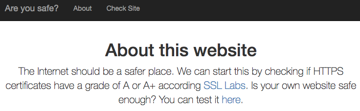

Lucky for me, I already own a few domains and an Amazon Web Services (AWS) account. Using these, I created a new AWS instance and pointed one of my domains (tylerhoyt.com) at it.

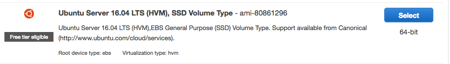

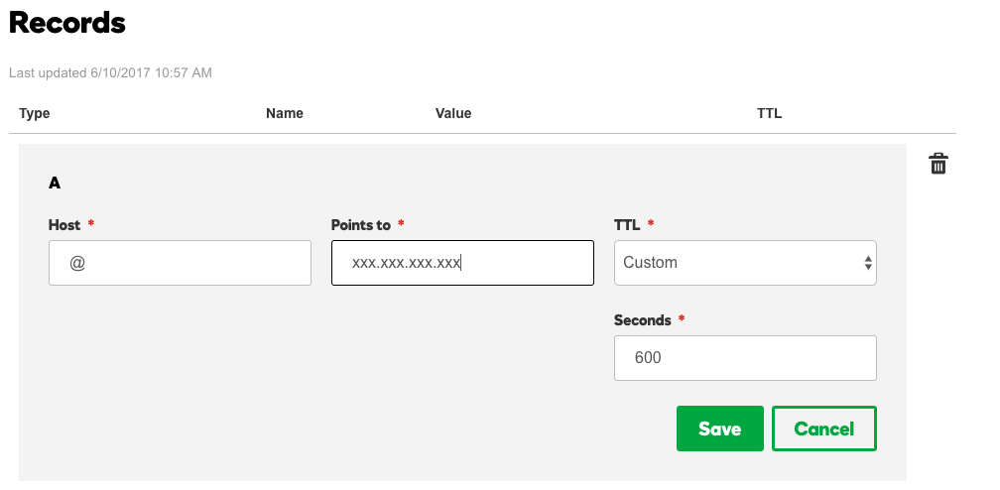

After the server finished Initializing, I SSH'd into it and installed Apache.

`sudo apt-get install apache2`

Once the install is finished, start the server with the following command.

`sudo apache2ctl start`

Now connect through http to confirm the server is running properly and you should see the default Apache page.

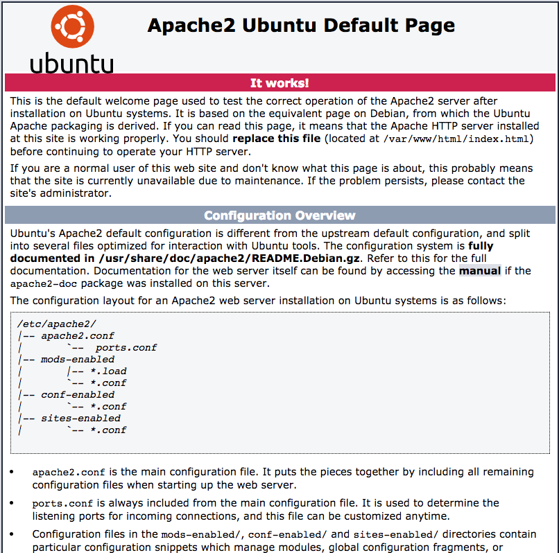

Great! you got your server up and running, now to install SSL.

This task has been made incredibly easy thanks to the work of the [Electronic Frontier Foundation](https://www.eff.org/)(EFF). There is a fantastic utility called [Certbot](https://certbot.eff.org/) which automates the entire process for you.

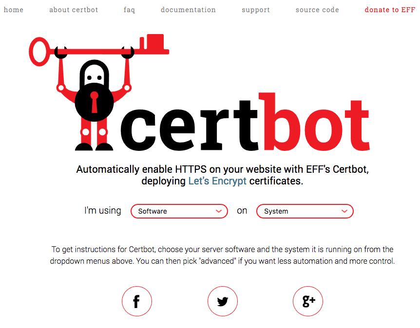

Simply select the software your using, in my case Apache2, and the system your on, in my case Ubuntu 16.04. After that it will provide you simple instruction on how to install and run.

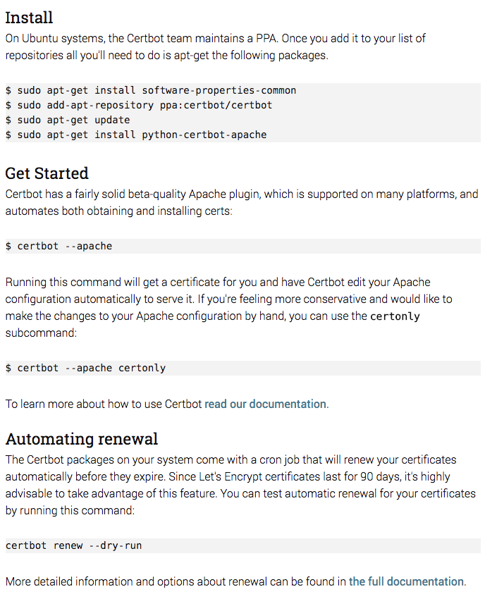

Copying these instructions into your server's shell and following the directions on the screen will fully install SSL and enable it on your server.

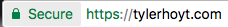

It's that easy! Thanks EFF!

Now all that's left to do is follow the directions form the CTF.

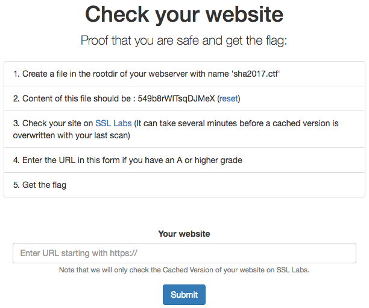

Create this file in the root dir of your webserver (default is /var/www/html)

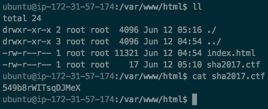

Now check to make sure you have an A or above rating on SSL Labs.

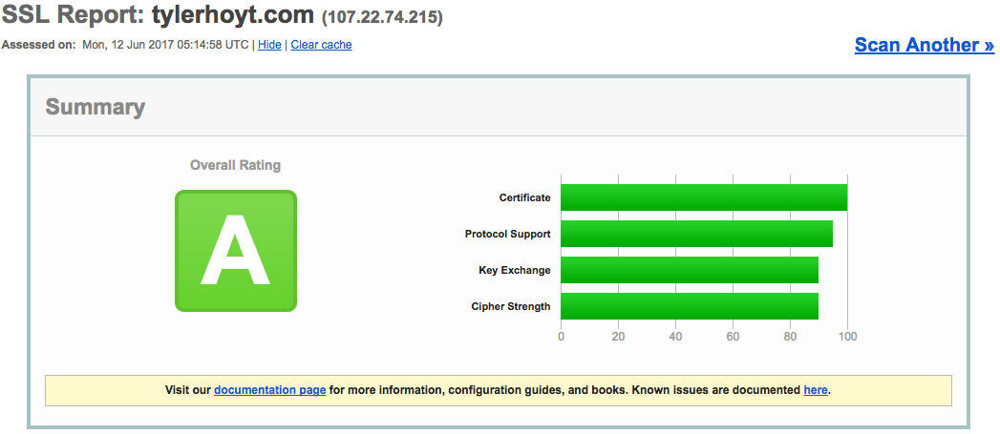

All that's left now is to plug our URL into the CTF tester and get our flag.

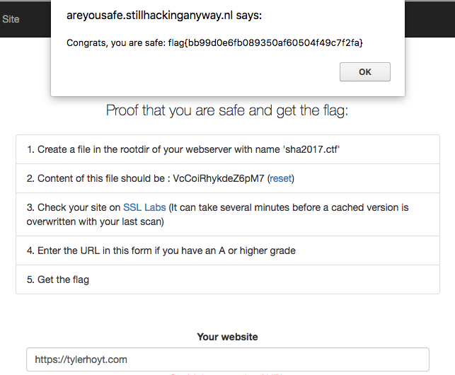

It's that easy, and now you have a nice SSL enabled Apache server to start that blog you've been thinking about starting!
