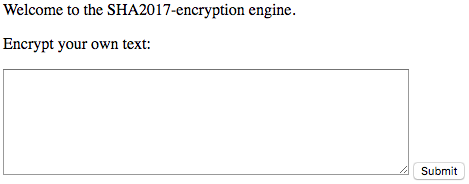
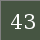
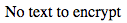
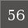
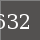
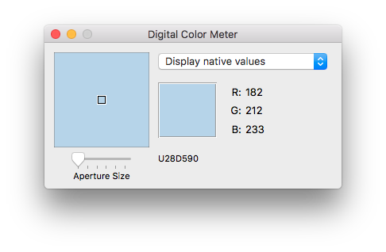
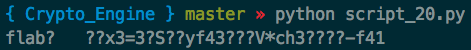
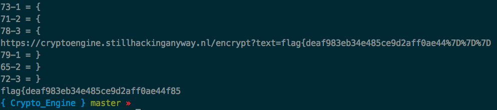

# SHA2017 Teaser - CryptoEngine

---

The challenge is to decrypt the flag from an image.


There is also a tool to encode any entered text



When you submit this box a new page is displayed with a single image. Lets try this with the string "test".

encrypt(test) =


Cool! Now lets test with simple strings, try "a"

encrypt(a) =


This is curious... It seems to be too short, lets try other lengths.

encrypt(aa) =


encrypt(aaa) =


Got it! The minimum length seems to be three characters. Lets keep going.

encrypt(aaaa) =


Okay... we have some characters added to it, and examining the RGB we have the same color.

encrypt(aaaaa) =


We have some more characters but they seem to be cut off, again, the same color.

encrypt(aaaaaa) =


Very interesting... now we have two squares and no text. From this you should be able to conclude that every three characters equates to a square and any remainder contributes to some text.

It's curious... three chars to a square, and three colors make up that square, Red Green and Blue (RGB).

Let's look at the individual color values for these squares. Lucky for me, my mac has a built in tool "Digital Color Meter" which happily gives me the RGB of whatever pixel my mouse is over.



Lets look some RGB values for different codes.

| Code |  R  |  G  |  B  |
|:----:|:---:|:---:|:---:|
| aaa  | 83  | 81  | 80  |
| aab  | 83  | 81  | 83  |
| aba  | 83  | 82  | 80  |
| baa  | 80  | 81  | 80  |

Awesome! WE GOT IT... Maybe...

Each letter for the three block code is directly related to the R, G or B value respective of position. ie. A in position 1 is 83, a in position 2 is 81, a in position 3 is 80.

At this point, we make the assumption that this is the same for all blocks and write a script to map each character and position to the integer value. I encoded this in a Python dictionary, the key being the color value concatenated with the position (R is pos 1, G is pos 2, B is pos 3), and the value stored is the character. What I ended up with is a table that looks like this.

| Key | Value |
|:---:|:-----:|
|83-1 | a     |
|81-2 | a     |
|80-3 | a     |
|80-1 | b     |
|82-2 | b     |
|83-3 | b     |
| ... |  ...  |

The code is below:
```python
import sys
import string
import urllib
import urllib2
import pickle
from PIL import Image

# Set up base variables
base_url = "https://cryptoengine.stillhackinganyway.nl/encrypt?text="
hashes = {}

# Loop over all printable ascii characters.
for c in string.printable:
    # Create a string of three of the character. ie. aaa, bbb, ccc, ...
    text = urllib.quote_plus(c * 3)
    # Append the text to encode to the URL.
    url = base_url + text

    print url

    # Read the result of the request into a variable.
    # The result in our case will be a PNG image.
    content = urllib2.urlopen(url).read()

    # Write this image to a file. This should not be necessary, but it's
    # the only way I know to then read it into Python's Image library.
    f = open( text + '.png', 'w' )
    f.write(content)
    f.close()

    # Read the image in so we can get the RGB.
    im = Image.open(text + '.png')
    pix = im.load()
    # Set the X, Y position to read the RGB pixel value form.
    x = 3
    y = 3

    # Each position will represent the R, G and B color values of the pixel.
    # Red = pos 1, Green = pos 2, Blue = pos 3
    for pos in [1, 2, 3]:

        # Set the key of our dictionary to the value of the R, G or B
        # at the specified X, Y and append the position.
        key = str(pix[x,y][pos - 1]) + "-" + str(pos)

        print key +  " = " + value

        # Add our character to the dictionary with at the key.
        hashes[key] = c

# Save our entire dictionary to a file so that we can load it back.
with open('hashes.pickle', 'w') as f:
    pickle.dump([hashes], f)
```

Now that we have our nice Python dictionary of all our values, let's go and make another script to read the pixel of each square of the flag and get one step closer to our points. After this we'll just have to figure out those last two parts that make up our flag.

```python
import os, sys
import string
import urllib2
import urllib
import pickle
from PIL import Image


# Load up the hashtable we created.
with open('hashes.pickle') as f:  # Python 3: open(..., 'rb')
    hashes = pickle.load(f)[0]

    # Open out flag image.
    im = Image.open('flag.png')
    pix = im.load()

    # Set up a variable to hold the flag
    flag = ""

    # There are 12 squares in the flag so we itterate over each one.
    for offset in range(12):
        # Add the square offset (40px is the width) to the x.
        x = 3 + (offset * 40)
        y = 3
        # For each R, G and B value of the color...
        for pos in [1, 2, 3]:

            # Debug print statement
            #print "RGB for [" + str(x) + ", " + str(y) + "] (Square: " + str(offset + 1) + ")= " + str(pix[x,y])

            # Generate the key from the color value and the string pos
            key = str(pix[x,y][pos - 1]) + "-" + str(pos)

            # Check that we actually have a key so that we don't get an error.
            # If we have it, print the value, otherwise a "?"
            if hashes.has_key(key):
                flag = flag + hashes[key]
            else:
                flag = flag + "?"

    # Print the final flag
    print flag
```

Just one problem here....



The interesting part here is that we got the first 3 right, but why if the rest garbage? To the keen observer, you may have noticed the encrypted version of "aaaaaa" above.

encrypt(aaaaaa) =


Even though the first and second square are both "aaa", they have different colors. Lets go crazy and see if we find a pattern.

encrypt(aaaaaaaaaaaaaaaaaaaaaaaaaaaaaaaaaaaa) =


There seems to be some repetition starting at the 9th square, lets test more to confirm.

encrypt(zzzaaaaaaaaaaaaaaaaaaaaaaaaaaaaaaaaa) =


Oddly, there is still repetition between the first and ninth square, even though the first and ninth square are made up of different letters. (zzz for the first and aaa for the ninth)

Rather than going down this rabbit hole of finding a pattern here, lets test how each squares values effect the others. We'll start without "aaaaaa" encryption. and compare it to "zzzaaa"

encrypt(aaaaaa) =

= [83,81,80], [86, 50,48]

encrypt(zzzaaa) =

= [72,74,75], [86,41,43]

encrypt(aaazzz) =

= [83,81,80], [77, 41,43]

Changing the fist clearly changes the second square, but changing the second has no effect on the first.

We proved earlier that within a grouping of three, the characters directly relate to the letter without effecting each other. Remember testing the "b" in different locations? I think we're onto something.

Knowing what we know now, we can modify our previous program to build our flag three characters at a time. When we solve the first three, we'll plug them in in front of the next testing group and solve for the next three. We can then repeat this process for each square until we build up the flag. Let's look at this program now.

Note: I realized at this point that the md5 hash that is the key is made up of only hex characters. With that we shortened our search space to only include hex characters, the letters of the word "flag" and the "{" and "}". This set is much smaller than the full printable characters and contains all possible characters we may see in the flag.

```python
import os, sys
import string
import urllib2
import urllib
import pickle
from PIL import Image

# Set up our variables.
base_url = "https://cryptoengine.stillhackinganyway.nl/encrypt?text="
flag = ""
hashes = {}
# Load in our flag image
im = Image.open("flag.png")
flag_pix = im.load()

# There are 12 squares in the flag, so we much loop over each of them.
for square in range(12):

    # Set the X, Y position to read the RGB pixel value form.
    # We also add our square offset for each individual square
    x = 3 + (40 * square)
    y = 3

    # This set is all characters that may appear in the flag.
    # We know the flag is of the format flag{md5} and the md5 is represented as
    # hex encoding.
    for c in string.hexdigits + "l" + "g" + "{" + "}":
        # Append our set of characters to the current flag we have.
        to_encode = flag + urllib.quote_plus(c * 3)
        # Append this to our URL to get the full path.
        url = base_url + to_encode

        # Debug Output
        print url

        # Read the result of the request into a variable.
        # The result in our case will be a PNG image.
        content = urllib2.urlopen(url).read()

        # Write this image to a file. This should not be necessary, but it's
        # the only way I know to then read it into Python's Image library.
        f = open( to_encode + '.png', 'w' )
        f.write(content)
        f.close()

        # Read the image in so we can get the RGB.
        im = Image.open(to_encode + '.png')
        pix = im.load()

        # Each position will represent the R, G and B color values of the pixel.
        # Red = pos 1, Green = pos 2, Blue = pos 3
        for pos in [1, 2, 3]:

            # Set the key of our dictionary to the value of the R, G or B
            # at the specified X, Y and append the position.
            key = str(pix[x,y][pos - 1]) + "-" + str(pos)

            print key +  " = " + c

            # Add our character to the dictionary with at the key.
            hashes[key] = c

    # Now that we have our dictionary for this set,
    # look up the corrosponding characters
    for pos in [1, 2, 3]:
        # Generate the key from the color value and the string pos
        key = str(flag_pix[x,y][pos - 1]) + "-" + str(pos)

        # Check that we actually have a key so that we don't get an error.
        # If we have it, print the value, otherwise a "?"
        if hashes.has_key(key):
            flag = flag + hashes[key]
        else:
            flag = flag + "?"
    # Print out flag so far
    print flag
```

GOT IT! Now's the time to jump on Slack and tell your friends you really got something!



We're so close at this point. There's one final part. The last two characters srill need to be figured out. Remember those? The two that are encoded as ascii characters in the image?

This last bit isn't bad. We know the last character has to be a "}" to match the format of the flags, so we only have 16 possible characters for the second to last. These we can do by hand playing with the URL in your favorite browser.

Flag =


Now, lets try 0-f in that second to last.

encrypt(flag{deaf983eb34e485ce9d2aff0ae44f850}) =


So close! If we try a few more, we cquickly find our answer.

encrypt(flag{deaf983eb34e485ce9d2aff0ae44f852}) =

